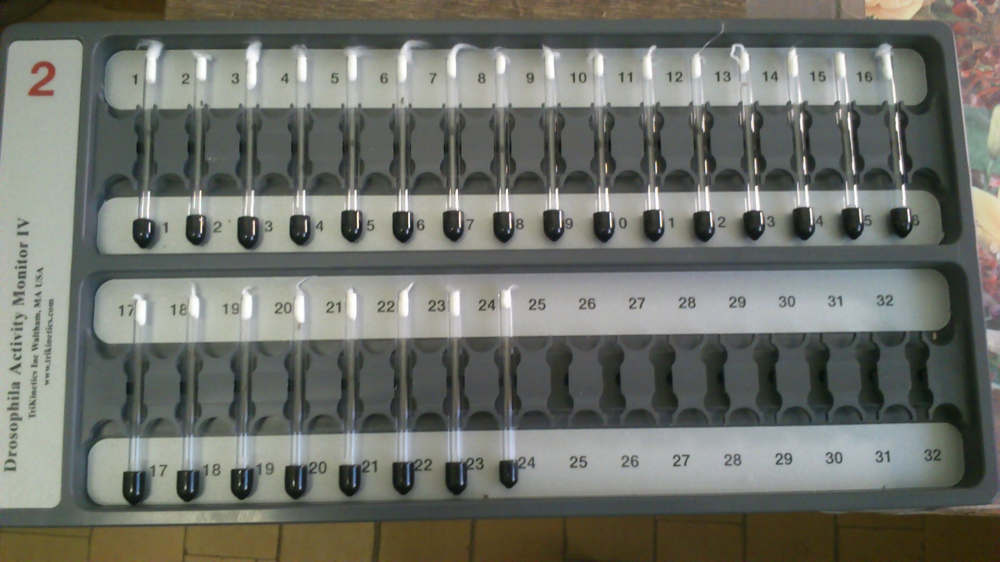
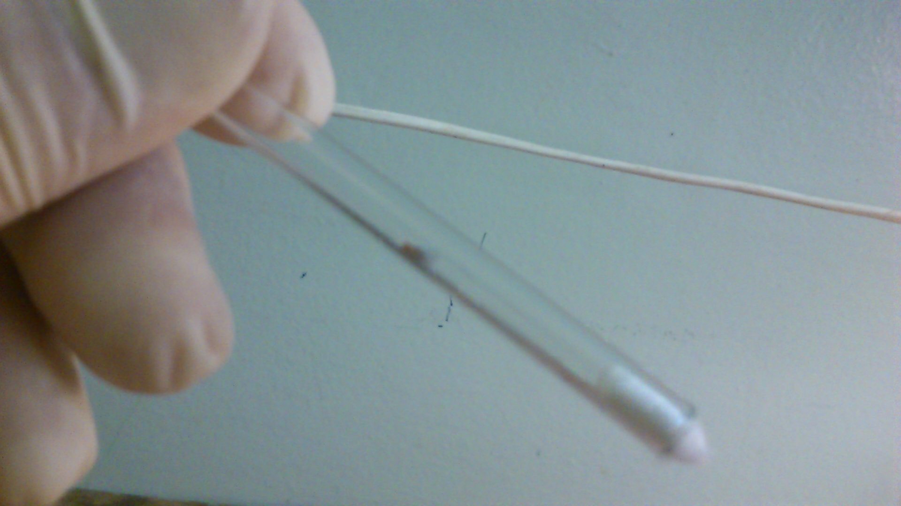

In this post, I want to start summarizing the most important lessons I learnt while working in aging research. I personally don't enjoy writing, it takes a lot of time and effort, and the reward for all that is usually disproportional. I never liked the "publish or perish" paradigm, I would usually only start writing a paper when I am excited about the results I have or about to produce, and have no choice but to write them up in some tangible form to share with others. Below, I'll try to highlight and share those specific excitements I had for some of the paper I co-authored, and which I personally value a lot. Some results have remained unpublished in a peer reviewed form, though I'll start with describing my first aging experiment.

My journey into aging started when I joined ([Quantum Pharmaceuticals](https://www.linkedin.com/company/quantum-pharmaceuticals)) that was pivoting into aging research. They raised a new round to test whether it's possible to build a biomarker of aging based on locomotor activity collected with wearables, such as low-frequency mass market [Fitbit](https://fitbit.com) and niche high-frequency accelerometers [ActiGraph](https://theactigraph.com/actigraph-wgt3x-bt), and later from Apple Watch and others. The aging part of the company later span off as [Gero](https://gero.ai/), and that's where my first projects in aging research started. In 2013, I did a summer internship at [Alexey Moskalev](https://www.linkedin.com/in/alexey-moskalev-223b1327)'s lab in Syktyvkar (he was studying aging in flies back then), trying to measure locomotor activity of flies and identify some patterns that would vary across various strains of flies with a Drosophila Activity Monitor (DAM) system by [TriKinetics](https://trikinetics.com/).

<figure>
    
    <figcaption>Locomotor activity monitor by TriKinetics</figcaption>
</figure>

Retrospectively, I'd say that it was definitely a rough start for me because these signals are ones of the most complex to work with I have seen so far. The signal is extremely dynamic, and the signal to noise ratio for the aging component is relatively tiny. For strains of flies with dramatically different lifespan, it was barely possible to see any different in locomotor activity. Personally, I think it was quite a disappointing learning for me that not every scientific problem in aging may have a positive solution, though after that it was always easier for me. Years later, my colleague Tim Pyrkov would end up publishing a few papers on the locomotor biomarkers of aging — it would require quite a lot of effort and aggregated data (by the [UK Biobank](https://www.ukbiobank.ac.uk/) and the [NHANES](https://www.cdc.gov/nchs/nhanes/index.htm)) to see anything interesting in that aging signal — you can check them out [(Pyrkov et al. 2018)](https://www.aging-us.com/article/101603/text) and [(Pyrkov et al. 2021)](https://www.aging-us.com/article/202816/text). The number of samples required to detect age-related changes with the signal-to-noise ratio of locomotor activity ended up in the range of dozens of thousands of longitudinal trajectories. 

One interesting lesson for me from my own experience in the wetlab of Alexey was that wetlab experiments could definitely be finicky. I was taking care of the measurements of locomotor activity. Each fly would be kept in a separate tube of a device with a laser beam counting how many time a fly would cross the beam. The problem was that flies were alive, and they needed to eat regularly — hence, I had to replace their feeding media regularly (every few days). Each time I would have to extract hundreds of tubes, prepare clean ones with media replaced, and transfer the flies into the new tubes. It was definitely easier said than done. 

<figure>
    
    <figcaption>Fruit fly inside one of the TriKinetics tubes</figcaption>
</figure>

The flies would try to escape, so I had to use ether to put them to sleep in between the transfers. The tubes were also super narrow, the flies would be having hard times rotating themselves inside the type. One mutant strain was so huge that they could barely turn in the tube. They would also stick to the media, etc. The first round was done within a month, I collected the data from the sensors, and realized that the only strong signal was their disrupted circadian rhythm, and not due to aging, but because the measurement itself and media exchange would trigger the cycle disruption. That was an interesting learning, but I had to redo the whole experiment again in complete darkness. We would block out the sunlight with huge sheets of black paper, and I would borrow my father's red light lamp (he used to be doing photography when he was younger). The second iteration was way more fun for me, though I had to work in complete darkness under the red lamp's light and transfer hundreds of flies from their old tubes to the new ones. The second round of data collection and analysis was way cleaner, there was no detectable disruption of circadian rhythm by the media exchange. The major component of aging changes and inter-strain changes was definitely their shifting circadian rhythm. Apart from that, there was barely any detectable aging signal which I could use to build a biomarker of age or lifespan. Even though, there was no scientific breakthrough in my work. I really enjoyed my time spent in Alexey's lab, and interaction with my labmates there — they were super helpful in my crazy experiments, and I learnt a ton from them.

<figure>
    
    <figcaption>A vial full of fruit flies</figcaption>
</figure>

P.S. The later works of Tim would largely agree with what I could extract from the fly data — the dominant change would be either the change in overall activity levels and/or the shift of circadian rhythms (older people indeed wake up earlier on average, and it's well seen when analyzing a lot of data). Other signals would also be present, but their extraction would require quite a lot of feature extraction and tinkering with the data.

### References

1. T.V. Pyrkov, E. Getmantsev, B. Zhurov, K. Avchaciov, M. Pyatnitskiy, L.I. Menshikov, K. Khodova, A.V. Gudkov, P.O. Fedichev. Quantitative characterization of biological age and frailty based on locomotor activity records. *Aging (Albany NY)* **10**, 2973-2990 (2018).[10.18632/aging.101603](https://doi.org/10.18632/aging.101603)
2. T.V. Pyrkov, I.S. Sokolov, P.O. Fedichev. Deep longitudinal phenotyping of wearable sensor data reveals independent markers of longevity, stress, and resilience. *Aging (Albany NY)* **13**, 7900-7913 (2021).[10.18632/aging.202816](https://doi.org/10.18632/aging.202816)