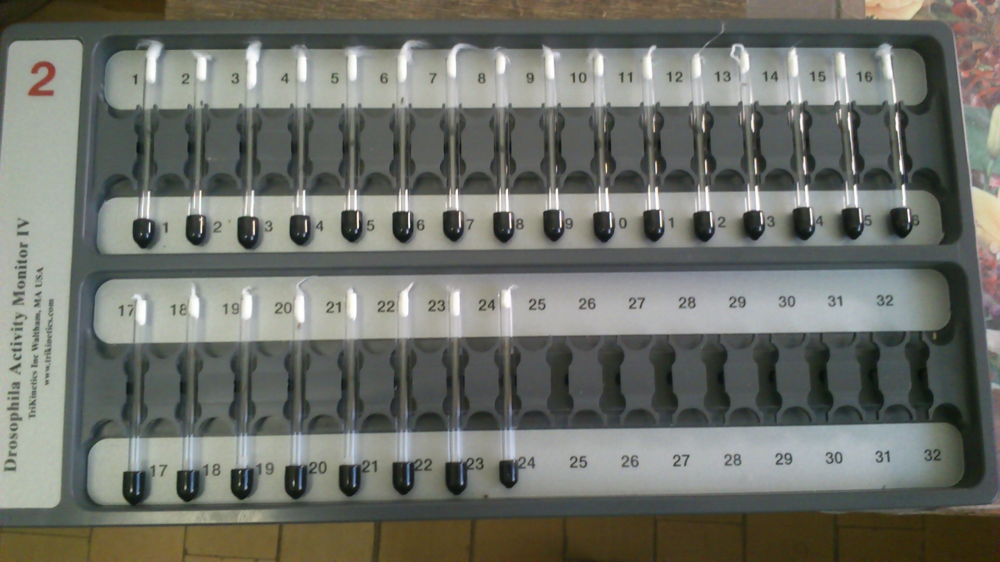

В этом посте я хочу начать обобщать наиболее важные уроки, которые я извлёк, работая в области исследования старения. Лично мне не нравится писать, это занимает много времени и усилий, а вознаграждение за всё это обычно непропорционально. Мне никогда не нравилась парадигма «публикуй или погибни», я обычно начинал писать статью только тогда, когда был взволнован результатами, которые получил или собирался получить, и у меня не было другого выбора, кроме как оформить их в какую-то осязаемую форму, чтобы поделиться с другими. Ниже я постараюсь выделить и поделиться теми конкретными волнующими моментами, которые у меня были для некоторых статей, которые я написал в соавторстве, и которые я лично очень ценю. Некоторые результаты остались неопубликованными в рецензируемой форме, хотя я начну с описания своего первого эксперимента по старению.

Мой путь в исследование старения начался, когда я присоединился к ([Quantum Pharmaceuticals](https://www.linkedin.com/company/quantum-pharmaceuticals)), которая делала пивот в сторону исследований старения. Они привлекли новый раунд, чтобы проверить, возможно ли построить биомаркер старения на основе локомоторной активности, собранной с помощью носимых устройств, таких как низкочастотные массовые [Fitbit](https://fitbit.com) и нишевые высокочастотные акселерометры [ActiGraph](https://theactigraph.com/actigraph-wgt3x-bt), а позже Apple Watch и других. Часть компании, связанная со старением, позже выделилась как [Gero](https://gero.ai/), и именно там начались мои первые проекты в исследовании старения. В 2013 году я прошёл летнюю стажировку в лаборатории [Алексея Москалёва](https://www.linkedin.com/in/alexey-moskalev-223b1327) в Сыктывкаре (он тогда изучал старение у мух), пытаясь измерить локомоторную активность мух и идентифицировать некоторые паттерны, которые варьировались бы у разных штаммов мух с помощью системы мониторинга активности дрозофилы (DAM) от [TriKinetics](https://trikinetics.com/).

<figure>
    
    <figcaption>Монитор локомоторной активности от TriKinetics</figcaption>
</figure>

Ретроспективно я бы сказал, что это определённо было грубое начало для меня, потому что эти сигналы одни из самых сложных для работы из тех, что я видел до сих пор. Сигнал чрезвычайно динамичен, а отношение сигнал-шум для компонента старения относительно крошечное. Для штаммов мух с драматически разной продолжительностью жизни едва можно было увидеть какую-либо разницу в локомоторной активности. Лично я думаю, что это было довольно разочаровывающим уроком для меня, что не каждая научная проблема в старении может иметь положительное решение, хотя после этого мне всегда было легче. Годы спустя мой коллега Тим Пырков в итоге опубликовал несколько статей о локомоторных биомаркерах старения — потребовалось довольно много усилий и агрегированных данных (от [UK Biobank](https://www.ukbiobank.ac.uk/) и [NHANES](https://www.cdc.gov/nchs/nhanes/index.htm)), чтобы увидеть что-то интересное в этом сигнале старения — вы можете посмотреть их [(Pyrkov et al. 2018)](https://www.aging-us.com/article/101603/text) и [(Pyrkov et al. 2021)](https://www.aging-us.com/article/202816/text). Количество образцов, необходимых для обнаружения возрастных изменений при отношении сигнал-шум локомоторной активности, оказалось в диапазоне десятков тысяч лонгитюдных траекторий.

Один интересный урок для меня из моего собственного опыта в wet-lab Алексея состоял в том, что wet-lab эксперименты определённо могут быть капризными. Я отвечал за измерения локомоторной активности. Каждая муха содержалась в отдельной пробирке устройства с лазерным лучом, подсчитывающим, сколько раз муха пересечёт луч. Проблема была в том, что мухи были живыми, и им нужно было регулярно есть — поэтому мне приходилось регулярно заменять их питательную среду (каждые несколько дней). Каждый раз мне приходилось извлекать сотни пробирок, готовить чистые с заменённой средой и переносить мух в новые пробирки. Это определённо было легче сказать, чем сделать.

<figure>
    
    <figcaption>Плодовая мушка внутри одной из пробирок TriKinetics</figcaption>
</figure>

Мухи пытались сбежать, поэтому мне приходилось использовать эфир, чтобы усыплять их между переносами. Пробирки также были очень узкими, мухам было трудно поворачиваться внутри. Один мутантный штамм был настолько огромным, что они едва могли развернуться в пробирке. Они также прилипали к среде и т.д. Первый раунд был завершён в течение месяца, я собрал данные с датчиков и понял, что единственным сильным сигналом было нарушение их циркадного ритма, и не из-за старения, а потому что само измерение и замена среды вызывали нарушение цикла. Это был интересный урок, но мне пришлось повторить весь эксперимент снова в полной темноте. Мы заблокировали солнечный свет огромными листами чёрной бумаги, и я одолжил красную лампу моего отца (он занимался фотографией в молодости). Вторая итерация была гораздо интереснее для меня, хотя мне пришлось работать в полной темноте под светом красной лампы и переносить сотни мух из старых пробирок в новые. Второй раунд сбора и анализа данных был намного чище, не было обнаружено никакого нарушения циркадного ритма из-за замены среды. Основным компонентом возрастных изменений и межштаммовых изменений определённо был их смещающийся циркадный ритм. Помимо этого, практически не было никакого обнаруживаемого сигнала старения, который я мог бы использовать для построения биомаркера возраста или продолжительности жизни. Хотя научного прорыва в моей работе не было, мне очень понравилось время, проведённое в лаборатории Алексея, и взаимодействие с моими коллегами по лаборатории — они были очень полезны в моих безумных экспериментах, и я многому у них научился.

<figure>
    
    <figcaption>Флакон, полный плодовых мушек</figcaption>
</figure>

P.S. Более поздние работы Тима в целом согласовались с тем, что я смог извлечь из данных о мухах — доминирующим изменением было либо изменение общего уровня активности, и/или сдвиг циркадных ритмов (пожилые люди действительно в среднем просыпаются раньше, и это хорошо видно при анализе большого количества данных). Другие сигналы также присутствовали, но их извлечение требовало довольно много работы с признаками и ковыряния в данных.

### Литература

1. T.V. Pyrkov, E. Getmantsev, B. Zhurov, K. Avchaciov, M. Pyatnitskiy, L.I. Menshikov, K. Khodova, A.V. Gudkov, P.O. Fedichev. Quantitative characterization of biological age and frailty based on locomotor activity records. *Aging (Albany NY)* **10**, 2973-2990 (2018).[10.18632/aging.101603](https://doi.org/10.18632/aging.101603)
2. T.V. Pyrkov, I.S. Sokolov, P.O. Fedichev. Deep longitudinal phenotyping of wearable sensor data reveals independent markers of longevity, stress, and resilience. *Aging (Albany NY)* **13**, 7900-7913 (2021).[10.18632/aging.202816](https://doi.org/10.18632/aging.202816)
